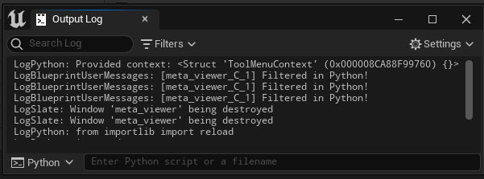
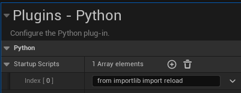

# <span style="color:white">Python Conveniences</span>

When developing code for Unreal there are a few conveniences we can undertake to make our lives easier.

This page covers the [unreal_systems](../unreal_plugin/PythonRecipeBook/Content/Python/demo/unreal_systems.py) python module


## <span style="color:yellow">Reload is our friend</span>
<ul>

When developing Unreal Python tools I regularly using the Python input on the Output Log Window:



We don't always need to relaunch Unreal to try out a few changes to a module's logic, instead we can reload it
here and try again:
    
```python
from importlib import reload
from demo import bp_library
    
reload(bp_library)

# Result: Display: Reload/Re-instancing Complete: 1 class changed
```
    
Our blueprint function library is now updated in Unreal!

One of the few lines I cannot recommend enough to include in the Python Plugin settings is `from importlib import reload`:



With this setting added the `reload` function will be automatically available in the Editor's Python Interpreter.
Any common imports you find yourself constantly running can be added to this area, they will be instantly available on Editor startup.

</ul>
<br>


## <span style="color:yellow">Convenience Modules For Unreal Systems</span>
<ul>

As you read the rest of the documentation you will encounter many code snippets using something from the
[unreal_systems](../unreal_plugin/PythonRecipeBook/Content/Python/demo/unreal_systems.py) module, this is a preference of mine to initialize most
unreal libraries and subsystems in a convenience module and reference that elsewhere. 
This is done to reduce the clutter in other tools, letting them focus on their actual logic instead of 
initializing the same libraries again and again.

### The Asset Registry
    
As an example, it's common to need the Asset Registry in certain functions:
```python
def is_content_browser_loaded():
    asset_registry_helper = unreal.AssetRegistryHelpers()
    asset_registry = asset_registry_helper.get_asset_registry()
    return not asset_registry.is_loading_assets()
```

With the `unreal_systems` module setting the Asset Registry up for us, we can instead use:
```python
def is_content_browser_loaded():
    return not unreal_systems.asset_registry.is_loading_assets()
```

<br>

### Editor and Engine Subsystems
    
Another use case for this convenience module are subsystems. Depending on the subsystem it may use either
[get_editor_subsystem()](https://docs.unrealengine.com/5.1/en-US/PythonAPI/module/unreal.html#unreal.get_editor_subsystem)
or
[get_engine_subsystem()](https://docs.unrealengine.com/5.1/en-US/PythonAPI/module/unreal.html#unreal.get_engine_subsystem)
to get the subsystem's global instance. 
    
While it is possible to use `unreal.AssetEditorSubsystem().do_the_thing()` to perform most subsystem functionality, the global instances
have additional bindings and connections that a new instance would not have. It is highly recommended to get the global instance of the 
desired subsystem, the global instance will perform all functions reliably and update the Editor UI correctly where a new instance might not.
    
Initializing the subsystems in one Python module ensure consistency across the code
base and reduces the frustrations of copying those functions around:
```python
AssetEditorSubsystem   = unreal.get_editor_subsystem(unreal.AssetEditorSubsystem)
EditorActorSubsystem   = unreal.get_editor_subsystem(unreal.EditorActorSubsystem)
EditorUtilitySubsystem = unreal.get_editor_subsystem(unreal.EditorUtilitySubsystem)
LevelEditorSubsystem   = unreal.get_editor_subsystem(unreal.LevelEditorSubsystem)  
```
and import them as needed in the other modules:
```python
from unreal_systems import (
    AssetEditorSubsystem,
    EditorActorSubsystem
)
```
Something I should point out in this example is that I did name my instances using PascalCase, which is generally reserved for class definitions and is technically bad. Feel free to use snake_case instead or camelCase, I did this purely out of laziness to make imports and Unreal Python Doc lookups easier.

</ul>
<br>


## <span style="color:yellow">Unreal's Abstraction Layer</span>
<ul>

Something worth remembering in Unreal Python is that Epic doesn't provide much in terms of an abstraction layer for the Python API, it's mostly a direct conversion
from C++ using the same reflection system as Blueprints. It's up to us to make our own Python-specific convenience functions and modules, simplifying Unreal calls and making them easier to use.

Taking advantage of the `unreal_systems` module, here's an example save function we could write to support both asset paths and object references:
```python
from sub_systems import EditorAssetSubsystem

def save_asset(asset):
    """Save the provided asset or asset path"""
    If isinstance(asset, unreal.Object):
        asset = asset.get_outermost().get_path_name()
    EditorAssetSubsystem.save_asset(asset)
```
[unreal.EditorAssetSubsystem.save_asset](https://docs.unrealengine.com/5.1/en-US/PythonAPI/class/EditorAssetSubsystem.html#unreal.EditorAssetSubsystem.save_asset)
requires the asset's path, if we wrap this function we can also support object references as well, meaning one less thing to worry about as we write other functions and tools.

</ul>
<br>


# <span style="color:yellow">Summary</span>
<ul>

It's not always something we think about first as developers, but it's well worth keeping an eye out for any repetitive tasks or tedious Unreal functions in the
Python API. It's perfectly fine to make convenience modules and wrapped functions in our code to simplify some of the Unreal Python calls, it can drastically
improve our own quality of life!

</ul>
