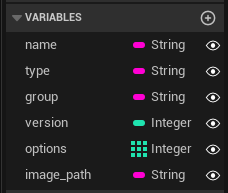
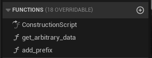

# <span style="color:white">Using Assets in Python</span>

Something that may not be clear at first is the ability to use Content Browser assets in Python.
Assets that we make for our Unreal project can be inspected in Python, have their functions called from
Python, and we can even initialize new instances of those assets from Python.


This page covers parts of the [utils](../unreal_plugin/PythonRecipeBook/Content/Python/demo/utils.py)
and [actors](../unreal_plugin/PythonRecipeBook/Content/Python/demo/actors.py)
python module

<br>


## <span style="color:yellow">Loading Assets in Python</span>
<ul>

Any asset in our Content Browser can be loaded in Python by its asset path. There are two functions available
to handle this, 
[unreal.load_asset()](https://docs.unrealengine.com/5.1/en-US/PythonAPI/module/unreal.html#unreal.load_asset)
or [EditorAssetLibrary.load_asset()](https://docs.unrealengine.com/5.1/en-US/PythonAPI/class/EditorAssetLibrary.html#unreal.EditorAssetLibrary.load_asset).
Either option is fine here, they will both give the same result:
```python
asset_path = "/PythonRecipeBook/sample_tools/widgets/meta_item_data"

asset = unreal.load_asset(asset_path)
# or 
asset = unreal_systems.EditorAssetLibrary.load_asset(asset_path)
```

With an asset loaded we can set some default class properties, to see what's available it's best to check 
the [Python Docs](https://docs.unrealengine.com/5.1/en-US/PythonAPI/).
As an example, on a `LevelSequence` asset we could call its 
[set_playback_start()](https://docs.unrealengine.com/5.1/en-US/PythonAPI/class/MovieSceneSequence.html#unreal.MovieSceneSequence.set_playback_start)
function to set its start frame using `asset.set_playback_start(50)`. Now when we open the `LevelSequence` in the Editor
it will start at frame `50`.

</ul>
<br>


## <span style="color:yellow">Initializing Blueprint Asset Instances in Python</span>
<ul>

Our Blueprint asset use in Python doesn't stop at loading assets, we can also create instances of them as well!
The Blueprint asset we loaded is an item data asset meant for an Editor Tool designed in 
[UMG](https://docs.unrealengine.com/5.1/en-US/umg-ui-designer-for-unreal-engine/).
It's relatively basic, mostly a container for some unique properties:



When we use this in our tool we'll want to create as many instances of this asset class as needed. 
The process to do so is relatively simple, we just need to get the loaded asset's 
[generated class()](https://docs.unrealengine.com/5.1/en-US/PythonAPI/class/Blueprint.html#unreal.Blueprint.generated_class)
and [create a new object()](https://docs.unrealengine.com/5.1/en-US/PythonAPI/module/unreal.html#unreal.new_object):
```python
asset_instance = unreal.new_object(asset.generated_class())
```

</ul>
<br>


## <span style="color:yellow">Populating Blueprint Asset Instances in Python</span>
<ul>

Now that we have a new instance we can set our unique information. 

When setting Blueprint variables from Python we can use 
[set_editor_properties()](https://docs.unrealengine.com/5.1/en-US/PythonAPI/class/_ObjectBase.html#unreal._ObjectBase.set_editor_properties),
this will allow us to set multiple variables in one call as a dict of {name:value} pairs:
```python
asset_instance.set_editor_properties({
    "name": "Eugene",
    "type": "duck"
})
```

For any singular property we can use
[set_editor_property()](https://docs.unrealengine.com/5.1/en-US/PythonAPI/class/_ObjectBase.html#unreal._ObjectBase.set_editor_property)
to set them or
[get_editor_property()](https://docs.unrealengine.com/5.1/en-US/PythonAPI/class/_ObjectBase.html#unreal._ObjectBase.get_editor_property)
to get them.

When setting or getting editor properties for any Blueprint assets you will need the exact programmatic name, this may differ from what is displayed
in the Unreal Editor.
</ul>
<br>


## <span style="color:yellow">Calling Blueprint Graph Functions In Python</span>
<ul>

Functions created in the Unreal Editor can be accessed via Python by using 
[call_method()](https://docs.unrealengine.com/5.1/en-US/PythonAPI/class/_ObjectBase.html#unreal._ObjectBase.call_method).
Using a Blueprint Actor as an example, if we had the Python reference to a spawned instance in a 3D Level we could use
this function to call any custom functions defined in the asset's Blueprint Graph.

So! Let's make some functions in the Blueprint Editor:



The first Blueprint function, `get_arbitrary_data`, returns a randon integer. The second Blueprint function, `add_prefix`, takes a
string input and returns it with an added prefix.

If the Blueprint function has no kwargs we can call it directly from the actor instance:
```python
test_data = actor_instance.call_method("get_arbitrary_data")
print(f"returned data: {test_data}")

# returned data: 17
```

If a function has inputs we can choose one of two delivery methods:
- a tuple of values
- a dict of {kwarg:value} pairs
    
<br>
    
```python
test_data = actor_instance.call_method("add_prefix", ("woohoo",))
print(f"returned data: {test_data}")

# returned data: processed_woohoo

test_data = actor_instance.call_method("add_prefix", kwargs={"base_string": "huzzah"})
print(f"returned data: {test_data}")

# returned data: processed_huzzah
```

Either option is fine to use, my preference is to use `kwargs` because I often mess up single item tuples.
    
### NOTE: `camelCase` and `args with spaces` get reformatted in Python
    
<ul>
    
If you use `camelCase` or any spaces in your Blueprint function names their access may be changed in Python
- `camelCaseArg` is automatically snake cased to `camel_case_arg`
- `arg with spaces` it wraps the spaces with underscores, it can be accessed with `arg_ _with_ _spaces`
- `snake_case` args will remain `snake_case` in Python
    
</ul>

</ul>
<br>


## <span style="color:yellow">Checking Inheritance</span>
<ul>

The only real concern when using 
[call_method()](https://docs.unrealengine.com/5.1/en-US/PythonAPI/class/_ObjectBase.html#unreal._ObjectBase.call_method)
is making sure your target actor/asset is of the correct type.
A more verbose example is available in the [actors](../unreal_plugin/PythonRecipeBook/Content/Python/demo/actors.py)
module, but this is how we can make sure an object instance inherits from our desired class:
```python
def is_functions_demo_actor(actor):
  # the package path of our base BP asset
  asset_path = "/PythonRecipeBook/sample_assets/ue_functions_demo"
  
  # check our test actor's class against the expected base class
  base_class = unreal_systems.EditorAssetLibrary.load_asset(asset_path).generated_class()
  return unreal.MathLibrary.class_is_child_of(actor.get_class(), base_class)
```

While I'm relatively certain it's okay to use Python's `isinstance()` function I used the math library's
[class_is_child_of()](https://docs.unrealengine.com/5.1/en-US/PythonAPI/class/MathLibrary.html#unreal.MathLibrary.class_is_child_of)
function in case there's any other unreal considerations I'm unaware of.

</ul>
<br>


# <span style="color:yellow">Summary</span>
<ul>

The ability to interact with Editor-made assets in Python is quite extensive. For custom Blueprint Assets we can create new 
instances of them, set their properties, and even run their functions all from Python.

Unreal Python isn't just about Blueprint Graphs using Python data, we can also use the assets from our unreal project
quite extensively in Python!

</ul>
