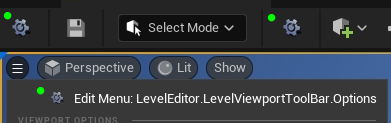
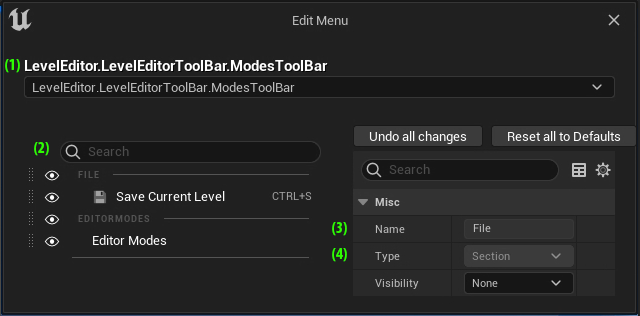
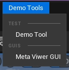
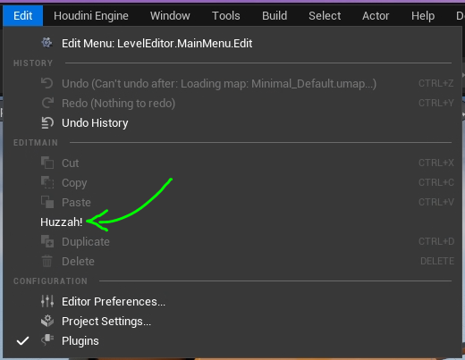

# <span style="color:white">Python Menus in Unreal</span>

When we build tools in Python for Unreal we may want to provide easy access to them in the Editor.
Most menu bars / areas in Unreal are actually already exposed to Python where we can add options to them. 
This page will cover how to find these Menus and the code required to add our options.

This page covers the [menus](../unreal_plugin/PythonRecipeBook/Content/Python/demo/menus.py)  python module

<br>

## <span style="color:yellow">Discovering Menus to Extend</span>
<ul>

Before we dive into any code let's discover what menus can be extended! 
In Unreal's `Cmd` prompt we can use this cvar setting to enable an edit/debug state on any valid menu panels:

```python
ToolMenus.Edit 1
```
With this cvar set an additional button will be added to any menus that we can extend (marked in green):



If we press one of these cog buttons it will open the `Edit Menu` window which looks like this:
 


This window is fantastic for our needs to determine the menu paths and what's already present.
In this window we can find the available menus' paths, see what sections are available to add to, 
and make sure we don't add any duplicate menu names.

Here's a breakdown of the noted areas in the above screenshot:
<ul>
<span style="color:lime">(1)</span> the menu name / path. We can use this to find the menu in Python!
<br>
<span style="color:lime">(2)</span> the menu contents, click on any entry here to view its details
<br>
<span style="color:lime">(3)</span> the name of the selected menu item
<br>
<span style="color:lime">(4)</span> the type of the selected menu item
</ul>

</ul>
<br>


# <span style="color:yellow">Getting a reference to a Menu</span>
<ul>

Out first step in extending a menu is getting a handle on it. Using the Edit Menu above I was able to find `LevelEditor.MainMenu`, 
with this menu path we can use [find_menu()](https://docs.unrealengine.com/5.1/en-US/PythonAPI/class/ToolMenus.html#unreal.ToolMenus.find_menu)
to get a Python reference to it: 
```python
unreal_tool_menus = unreal.ToolMenus.get()
target_menu = unreal_tool_menus.find_menu("LevelEditor.MainMenu")
```

We now have a reference to the main menu along the top of the Unreal Editor!
</ul>
<br>


# <span style="color:yellow">Adding a Sub Menu</span>
<ul>

Something we may wish to do is add a sub menu - instead of adding all of our menu items to `MainMenu` directly 
we can group them in their own dropdown together using 
[add_sub_menu()](https://docs.unrealengine.com/5.1/en-US/PythonAPI/class/ToolMenu.html#unreal.ToolMenu.add_sub_menu):

```python
dropdown_menu = target_menu.add_sub_menu(
    owner="demo_tools_manager_id", # this is a string ID to track the menus we're adding from Python
    section_name="",               # section names are the grey dividers WRITTEN IN CAPS in a menu,
                                   # this lets us add our sub menu to a given section if it's available
    name="demo_tools",             # this is the programmatic name of our tool (code facing)
    label="Demo Tools"             # this is what users will see in the menu (user facing)
)
```
Keeping track of the `owner` will let us remove these menus later if we'd like, but really the main thing here for us
is the `label`: what will the user see this displayed as?

</ul>
<br>


# <span style="color:yellow">Creating a Menu Entry Class</span>
<ul>

Unreal Menus is one of the areas of Unreal where we'll want to create new classes inheriting from other classes.
This will allow us to create and reuse functionality in the menu items' classes instead of muddying the logic that adds our menus to the UI.

To make our own base class we'll want to extend from 
[ToolMenuEntryScript](https://docs.unrealengine.com/5.1/en-US/PythonAPI/class/ToolMenuEntryScript.html#unreal.ToolMenuEntryScript).
Our init will use 
[init_entry()](https://docs.unrealengine.com/5.1/en-US/PythonAPI/class/ToolMenuEntryScript.html#unreal.ToolMenuEntryScript.init_entry) 
to prepare our entry for the desired menu and 
[add_menu_entry_object()](https://docs.unrealengine.com/5.1/en-US/PythonAPI/class/ToolMenu.html#unreal.ToolMenu.add_menu_entry_object)
to actually add it to the UI:

```python
@unreal.uclass()
class PythonMenuTool(unreal.ToolMenuEntryScript):
    name = "unique_programatic_tool_name"
    display_name = "menu display name"
    tool_tip = "tool tip message"
 
    def __init__(self, menu_object, section_name=""):
        """given a menu object and a section name, initialize this python tool and add it to the menu"""
        super().__init__()

        # Initialize the entry data
        self.init_entry(
            owner_name="demo_tools_manager_id",  # we'll use the same owner name to keep track of our tools
            menu=menu_object.menu_name,          # the menu to add this entry to
            section=section_name,                # the menu section to place this entry in
            name="python_demo_tool",             # the programmatic name of this entry
            label="Demo Tool"                    # the display name of this entry
        )

        # Add this tool to the desired menu
        menu_object.add_menu_entry_object(self)
```
Now we can fully setup any menu entries as part of its init.

To declare what our menu button will do when pressed we can override the
[execute()](https://docs.unrealengine.com/5.1/en-US/PythonAPI/class/ToolMenuEntryScript.html#unreal.ToolMenuEntryScript.execute)
function in our `PythonMenuTool`:
```python
    @unreal.ufunction(override=True)
    def execute(self, context):
        """The Python code to execute when pressed"""
        print(f"Provided context: {context}")
```
An [unreal.ToolMenuContext](https://docs.unrealengine.com/5.1/en-US/PythonAPI/class/ToolMenuContext.html#unreal.ToolMenuContext)
object is provided to determine where the menu entry was pressed from, for more advanced menu tools
you may wish to look into this, but we'll skip this for today.

An optional addition to our class is 
[can_execute()](https://docs.unrealengine.com/5.1/en-US/PythonAPI/class/ToolMenuEntryScript.html#unreal.ToolMenuEntryScript.can_execute),
this will control whether  the menu button is available:

```python
    @unreal.ufunction(override=True)
    def can_execute(self, context):
        """Can the user press this menu entry?"""
        print(f"Can we execute? Provided context: {context}")
        return os.getlogin() == "admin"
```
This can be useful for selection-based commands to ensure any conditions are met for our tool to work.

</ul>
<br>
 

# <span style="color:yellow">Extending the Menu Entry Class</span>
<ul>

There is a lot that can go into menu classes, but finding a solid base class can make subsequent classes easier to make.
As an example, extending this `PythonMenuTool` base class I can also provide a base menu class for launching editor tools made in UMG:
```python
@unreal.uclass()
class EditorUtilMenuTool(PythonMenuTool):
    """menu tool base class to launch specified Editor Utility Widgets"""
    widget_path = "some/path"

    @unreal.ufunction(override=True)
    def execute(self, context):
        """Open the EUW when pressed"""
        print(f"Provided context: {context}")
        editor_tools.launch_editor_utility_widget(self.widget_path)
```

With everything in place, here's all I need for each editor tool's menu class:

```python
@unreal.uclass()
class MetadataFilterTool(EditorUtilMenuTool):
    name = "meta_viewer"
    display_name = "Meta Viewer GUI"
    widget_path = "/PythonRecipeBook/sample_tools/meta_viewer"
```
 
And here's how this menu is added to the menu (more on this in the next section):

 ```python
MetadataFilterTool(menu=dropdown_menu)
```

This is just one way to organize menu classes, the goal with this method is to handle as much as possible in the base
classes to simplify the tool-specific child classes. 

</ul>
<br>


# <span style="color:yellow">Adding the Menu Entry Class</span>
<ul>

Using our `dropdown_menu` from earlier, this is all it takes to add our new tool:

```python
PythonMenuTool(dropdown_menu)
```

We can also use [add_section()](https://docs.unrealengine.com/5.1/en-US/PythonAPI/class/ToolMenu.html#unreal.ToolMenu.add_section)
to create a new section to place it under:
```python
section = "test"
dropdown_menu.add_section(section, section)
PythonMenuTool(dropdown_menu, section)
```

Our menu is now available in the Editor:



</ul>
<br>


# <span style="color:yellow">Inserting A Menu Entry</span>
<ul>

The method shown so far only adds entries to the end of the menu list.
This alternate method is something I learned about from reading 
[this github post by rondreas](https://gist.github.com/rondreas/eeecb0fcf52f05e898e0e31b22658068),
it will let us add a new entry between existing ones.

we'll first create another 
[ToolMenuEntryScript](https://docs.unrealengine.com/5.1/en-US/PythonAPI/class/ToolMenuEntryScript.html#unreal.ToolMenuEntryScript)
class like before, however this time its `__init__()` will not add the entry to its containing menu on init:
```python
@unreal.uclass()
class Huzzah(unreal.ToolMenuEntryScript):
    name = "huzzah"
    display_name = "Huzzah!"

    def __init__(self, menu_object, section):
        """Initialize our entry for the given menu_object's section"""
        super().__init__()

        # Initialize the entry data
        self.init_entry(
            owner_name="demo_tools_tracker",
            menu=menu_object.menu_name,
            section=section,
            name=self.name,
            label=self.display_name
        )

    @unreal.ufunction(override=True)
    def execute(self, context):
        print(f"Huzzah, good day to you! {context}")
```

<br>
 
In Unreal's `Edit` dropdown menu we'll add this menu right after the `Paste` entry. To do this we'll first get
a reference to the Edit menu and create an insert policy using a 
[ToolMenuInsert](https://docs.unrealengine.com/5.1/en-US/PythonAPI/class/ToolMenuInsert.html#unreal.ToolMenuInsert)
object:
```python
unreal_tool_menus = unreal.ToolMenus.get()
edit_menu = unreal_tool_menus.find_menu("LevelEditor.MainMenu.Edit")
section = "EditMain"

insert_policy = unreal.ToolMenuInsert("Paste", unreal.ToolMenuInsertType.AFTER)
```
We now have the Edit menu, an insert policy, and the section name that `Paste` is in.

<br>

To control how `Huzzah` is added to the menu we'll need to wrap it in a 
[ToolMenuEntry](https://docs.unrealengine.com/5.1/en-US/PythonAPI/class/ToolMenuEntry.html#unreal.ToolMenuEntry).
At a minimum we need to provide a script object, its menu item type, and instructions on how to insert it:
```python
entry = unreal.ToolMenuEntry(
        name = "woohoo",                             # programattic name of the insert operation
        type = unreal.MultiBlockType.MENU_ENTRY,     # the menu type being inserted
        insert_position = insert_policy,             # the menu insert policy
        script_object = Huzzah(edit_menu, section)   # the menu object to insert
)

# We'll add this wrapper entry to the edit menu:
edit_menu.add_menu_entry(section, entry)
```

A small difference here is that we're now using
[add_menu_entry()](https://docs.unrealengine.com/5.1/en-US/PythonAPI/class/ToolMenu.html#unreal.ToolMenu.add_menu_entry) 
instead of 
[add_menu_entry_object()](https://docs.unrealengine.com/5.1/en-US/PythonAPI/class/ToolMenu.html#unreal.ToolMenu.add_menu_entry_object) 
to add the entry. The first function allows us to tell the parent menu what we're adding to it and how, 
the second function just adds the entry script to the bottom of the parent menu.

<br>

Working this functionality back into our base class, we could make the `insert_policy` an option on the `__init__()` function:
```python
    def __init__(self, menu_object, section, insert_policy=None):
        """Initialize our entry for the given menu_object's section"""
        # (other init code)
        
        # handle insert policy if provided
        if insert_policy:
            # Build the entry insert object
            entry = unreal.ToolMenuEntry(
                name="huzzah",
                type=unreal.MultiBlockType.MENU_ENTRY,
                insert_position=insert_policy,
                script_object=self
            )

            # Add this tool to the desired menu
            # this will insert using the given policy
            menu_object.add_menu_entry(section, entry)

        else:
            # Add this tool to the desired menu
            # this will insert at the bottom of the menu
            menu_object.add_menu_entry_object(self)
```
This allows us to use the same base class for both use cases. If an insert policy is provided use it,
otherwise add this menu entry to the bottom of the list.


<br>
 
After running our code 
[(with a refresh to be safe)](https://docs.unrealengine.com/5.1/en-US/PythonAPI/class/ToolMenus.html#unreal.ToolMenus.refresh_all_widgets)
`Huzzah` has successfully been inserted after `Paste` in the Edit menu - huzzah!


 


</ul>
<br>


# <span style="color:yellow">Summary</span>
<ul>

The ability to add menus through Python grants us a lot of power to extend many areas of the Editor!
We can add file menu options, viewport options, create asset options, and even add to the Sequencer menu. 
It's well worth turning on the ToolMenus cvar and seeing just how much is available. 

As shown in this document there's different ways to add our menu entries. It's well worth looking into 
[ToolMenuEntry](https://docs.unrealengine.com/5.1/en-US/PythonAPI/class/ToolMenuEntry.html#unreal.ToolMenuEntry)
when you need more control over how a menu is added, but it's also perfectly acceptable to use a 
[ToolMenuEntryScript](https://docs.unrealengine.com/5.1/en-US/PythonAPI/class/ToolMenuEntryScript.html#unreal.ToolMenuEntryScript)
directly to just get it listed.

And to give credit once more, here is [rondreas' original implementation](https://gist.github.com/rondreas/eeecb0fcf52f05e898e0e31b22658068) 
for the menu insert method that I learned from.

</ul>
