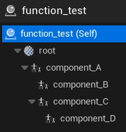

# <span style="color:white">Actor & Component Interactions</span>

While we may not be performing any gameplay elements via Python,
there are times when we may want tools to manage or inspect the actors in a given 3D level.
Knowing about actors can help us make scene management tools as well as custom importers and exporters.

In this document we'll focus on scene inspection and how to handle some of the more common aspects.

This page covers the [actors](../unreal_plugin/PythonRecipeBook/Content/Python/demo/actors.py) python module

<br>

## <span style="color:yellow">Getting the Top Level Actors</span>
<ul>

For scene management we may want to know what the top-level actors are in our scene.
UE 5.2 provides two convenience functions for getting a list of actors in our current 3D level: 
[get_all_level_actors()](https://docs.unrealengine.com/5.2/en-US/PythonAPI/class/EditorActorSubsystem.html#unreal.EditorActorSubsystem.get_all_level_actors)
and [get_selected_level_actors()](https://docs.unrealengine.com/5.2/en-US/PythonAPI/class/EditorActorSubsystem.html#unreal.EditorActorSubsystem.get_selected_level_actors).
You might notice that neither of these get the top-level actors for us.

What we can do here is get all actors and check if their parent is None. There are two flavors of checking an actor's
parent: 
- [get_attach_parent_actor()](https://docs.unrealengine.com/5.2/en-US/PythonAPI/class/Actor.html#unreal.Actor.get_attach_parent_actor) 
which handles actors nested in the 3D level 
- [get_parent_actor()](https://docs.unrealengine.com/5.2/en-US/PythonAPI/class/Actor.html#unreal.Actor.get_parent_actor)
which handles actors spawned by other actors
    
<br>

We'll revisit `nested` vs `spawned` in a bit, but the important thing here is to know we'll have to check both:

```python
# get all actors in the scene
scene_actors = unreal_systems.EditorActorSubsystem.get_all_level_actors()

top_level_actors = []
for actor in scene_actors:
    # make sure this actor isn't attached to or owned by another actor
    if not actor.get_attach_parent_actor() and not actor.get_parent_actor():
        top_level_actors.append(actor)

    
# alternately, if we like list comprehension
top_level_actors = [
    actor
    for actor in unreal_systems.EditorActorSubsystem.get_all_level_actors()
    if not actor.get_attach_parent_actor() and not actor.get_parent_actor()
]
```
And that's actually it, we now have our top level actors!

</ul>
<br>


## <span style="color:yellow">Spawned Vs Nested Actors</span>
<ul>

Before we inspect our actor hierarchy it's important to be aware of how an actor was spawned in the 3D level. 
<span style="color:orange">**actors can spawn other actors**</span>.  Here are some differences to be aware of 
between spawned and nested actors:

- <span style="color:orange">Spawned actors</span> (by code or an ActorComponent) are very limited in what can be changed from the 3D level / Python.
We cannot change display names or hierarchies of these spawned actors from Python and you may need to interact with their
parent actor instead

- <span style="color:orange">Nested actors</span> are actors attached to each other in the 3D level. We can change displays names, hierarchies, and any exposed
properties directly

</ul>
<br>


## <span style="color:yellow">Walking Actor Hierarchies</span>

<ul>
Keeping the differences in mind, let's separate the spawned actors from nested actors.

To achieve this we'll use both [get_attached_actors()](https://docs.unrealengine.com/5.2/en-US/PythonAPI/class/Actor.html#unreal.Actor.get_attached_actors) 
and [get_all_child_actors()](https://docs.unrealengine.com/5.2/en-US/PythonAPI/class/Actor.html#unreal.Actor.get_all_child_actors).
With the results of these two functions we'll be able to tell the nested actors apart from the spawned actors.

Here's our recursive function, it will print the current actor, its spawned actors, and then recurse through any nested actors:
```python
def walk_actor(actor, indent=0):
    """walk the given actor to print its hierarchy"""
    print(f"{'. '*indent}{actor.get_actor_label()}")

    # separate the nested actors from the spawned actors:
    spawned_actors = actor.get_all_child_actors()
    nested_actors = [
        child 
        for child in actor.get_attached_actors() # compare all children actors to the list
        if child not in spawned_actors           # of actors spawned by the current actor
    ]
    
    # print the spawned actors
    for child in spawned_actors:
        print(f"{'. ' * indent} > spawns {child.get_actor_label()}")
    
    # print the nested actors
    for child in nested_actors:
        walk_actor(child, indent+2)
```

With this function we can loop over our `top_level_actors` and get their actor hierarchy:

```python
for actor in top_level_actors:
    walk_actor(actor)
```

And here's our sample level's hierarchy, the `top` actor has nested actors whereas `function_test` spawns its actors

```
LogPython: Floor
LogPython: DirectionalLight
LogPython: SkyAtmosphere
LogPython: SkyLight
LogPython: ExponentialHeightFog
LogPython: VolumetricCloud
LogPython: SM_SkySphere
LogPython: top
LogPython: . . child_A
LogPython: . . child_C
LogPython: . . child_B
LogPython: nested_actor
LogPython: function_test
LogPython:  > spawns dict_A
LogPython:  > spawns int_C
LogPython:  > spawns dict_B2
LogPython:  > spawns int_D
```

</ul>
<br>


## <span style="color:yellow">Walking Component Hierarchies</span>
<ul>

It's not just actors that make up a scene - an actor's components can be just as important as the actor itself if not more-so. 
An actor can have any number of components and those components can have their own properties, 
transforms, and behaviors that we may need to be aware of.

To get the children of a component we can use
[get_children_components()](https://docs.unrealengine.com/5.2/en-US/PythonAPI/class/SceneComponent.html#unreal.SceneComponent.get_children_components).
Here's our basic recursive function, just like we did with actors we'll print the current component and then check its children:
```python
def walk_component(component, indent=2):
    """walk the given component to print its hierarchy"""
    print(f"{'. '*indent}{component.get_name()}")

    # recurse through any immediate children
    for child in component.get_children_components(False):
        walk_component(child, indent+2)
```
When calling this function we want to start from an actor's 
[root component](https://docs.unrealengine.com/5.2/en-US/PythonAPI/class/Actor.html#unreal.Actor.root_component),
all actor components must be attached under its root:
```python
print(actor.get_actor_label())
walk_component(actor.root_component)
```
```
LogPython: function_test
LogPython: . . root
LogPython: . . . . component_A
LogPython: . . . . . . DefaultSceneRoot
LogPython: . . . . . . . . BillboardComponent_0
LogPython: . . . . . . component_B
LogPython: . . . . . . . . DefaultSceneRoot
LogPython: . . . . . . . . . . BillboardComponent_0
LogPython: . . . . . . component_C
LogPython: . . . . . . . . DefaultSceneRoot
LogPython: . . . . . . . . . . BillboardComponent_0
LogPython: . . . . . . . . component_D
LogPython: . . . . . . . . . . DefaultSceneRoot
LogPython: . . . . . . . . . . . . BillboardComponent_0
```

And that's our full component hierarchy on the `function_test` actor! One thing to note is that our function currently
prints more entries than what's displayed in the Details Panel:



This is because `function_test` spawns child actors. If we only want to view the immediate components of our given actor we can add a 
[get_owner()](https://docs.unrealengine.com/5.2/en-US/PythonAPI/class/ActorComponent.html#unreal.ActorComponent.get_owner)
check to confirm the component is directly managed by the given actor:
```python
def walk_component(component, owner=None, indent=2):
    """walk the given component to print its hierarchy"""
    if component.get_owner() == owner or not owner:
        print(f"{'. '*indent}{component.get_name()}")

        # recurse through any immediate children
        for child in component.get_children_components(False):
            walk_component(child, owner, indent+2)
```

Using this implementation we'll also provide the actor:

```python
print(actor.get_actor_label())
walk_component(actor.root_component, actor)
```
```
LogPython: function_test
LogPython: ....root
LogPython: ........component_A
LogPython: ............component_B
LogPython: ............component_C
LogPython: ................component_D
```

Success! Now we're seeing the condensed version that's more user-friendly to look at. 
There are times when we will want the full depth, but for anything user-facing
we may want a simpler hierarchy to look at like the Outliner or Details Panel provides.
</ul>
<br>


## <span style="color:yellow">Determining an Actor's Source Asset</span>
<ul>
For Editor tools we may wish to know which Content Browser asset an actor represents. This information is stored differently
on each type of actor, for this document we'll focus on a few common types: blueprint, static mesh, and skeletal mesh actors.

### Blueprint Actors:
<ul>

To determine the source asset of a Blueprint Actor we can use [get_path_name()](https://docs.unrealengine.com/5.2/en-US/PythonAPI/class/_ObjectBase.html#unreal._ObjectBase.get_path_name)
on its class:
```python
actor.get_class().get_path_name()
```
</ul>

### Static Meshes:
<ul>

To determine the source asset of a [Static Mesh Actor](https://docs.unrealengine.com/5.2/en-US/PythonAPI/class/StaticMeshActor.html#unreal.StaticMeshActor)
we can query the [static_mesh](https://docs.unrealengine.com/5.2/en-US/PythonAPI/class/StaticMeshComponent.html#unreal.StaticMeshComponent.static_mesh)
property on the actor's root component:
```python
actor.static_mesh_component.static_mesh.get_path_name()
```
</ul>

### Skeletal Meshes:
<ul>

To determine the source asset of a [Skeletal Mesh Actor](https://docs.unrealengine.com/5.2/en-US/PythonAPI/class/SkeletalMeshActor.html#unreal.SkeletalMeshActor)
we can query the [skeletal_mesh](https://docs.unrealengine.com/5.2/en-US/PythonAPI/class/SkinnedMeshComponent.html#unreal.SkinnedMeshComponent.skeletal_mesh)
property on the actor's root component:
```python
actor.skeletal_mesh_component.skeletal_mesh.get_path_name()
```
</ul>

Rather than handle each type individually as needed we could create a function to handle this asset check for any actor:
```python
def get_asset_path_from_actor(actor):
    """
    Get the content browser asset path of the given actor,
    support must be added for each asset type
    """

    if isinstance(actor.get_class(), unreal.BlueprintGeneratedClass):
        asset = actor.get_class().get_outer()
    elif isinstance(actor, unreal.StaticMeshActor):
        asset = actor.static_mesh_component.static_mesh.get_outer()
    elif isinstance(actor, unreal.SkeletalMeshActor):
        asset = actor.skeletal_mesh_component.skeletal_mesh.get_outer()
    else:
        unreal.log_warning(f"Actor {actor.get_actor_label()} has an unknown or unsupported source asset")
        return ""

    return str(asset.get_path_name())
```
This approach can be used when walking the actor hierarchy to determine most of the source assets. 
Any unsupported asset types would need to be added to this function.

Another data point worth collecting alongside the asset path is the actor class:
```python
actor_class = actor.get_class().get_name()
```
For actors that won't have an asset, such as a light, we can use this information instead.

</ul>
<br>


## <span style="color:yellow">Spawning Actors</span>
<ul>

There are two methods to spawning an actor in our current 3D level: from 
[an unreal class](https://docs.unrealengine.com/5.2/en-US/PythonAPI/class/EditorActorSubsystem.html#unreal.EditorActorSubsystem.spawn_actor_from_class)
or from
[an asset](https://docs.unrealengine.com/5.2/en-US/PythonAPI/class/EditorActorSubsystem.html#unreal.EditorActorSubsystem.spawn_actor_from_object).


### From an Unreal Class:
<ul>

If we know the unreal class we can pass it to
[spawn_actor_from_class()](https://docs.unrealengine.com/5.2/en-US/PythonAPI/class/EditorActorSubsystem.html#unreal.EditorActorSubsystem.spawn_actor_from_class):

```python
actor = unreal_systems.EditorActorSubsystem.spawn_actor_from_class(unreal.DirectionalLight)
```

If this operation was part of an editor tool we might only have the name of the unreal class as a string.
In this instance we can use Python's `hasattr` and `getattr` functions to find and use the class:
```python
class_name = "DirectionalLight"
if hasattr(unreal, class_name):
    actor_class = getattr(unreal, class_name)
    actor = unreal_systems.EditorActorSubsystem.spawn_actor_from_class(actor_class)
```

</ul>

### From an Asset:
<ul>

From a loaded asset we can pass it to
[spawn_actor_from_object()](https://docs.unrealengine.com/5.2/en-US/PythonAPI/class/EditorActorSubsystem.html#unreal.EditorActorSubsystem.spawn_actor_from_object):

```python
asset_path = "/PythonRecipeBook/sample_assets/ue_functions_demo"
asset = unreal_systems.EditorAssetLibrary.load_asset(asset_path)
actor = unreal_systems.EditorActorSubsystem.spawn_actor_from_object(asset)
```
</ul>

</ul>
<br>


## <span style="color:yellow">Tracking Actor/Component Selection Change</span>
<ul>

This is a more advanced feature, but it is possible to actively track when the user changes their
selection in the 3D level as well!

We'll first create a function that we wish to call whenever the current actor selection has changed.
For this we'll expect to be provided an
[unreal.TypedElementSelectionSet](https://docs.unrealengine.com/5.2/en-US/PythonAPI/class/TypedElementSelectionSet.html#unreal.TypedElementSelectionSet)
selection set object:
```python
def selection_tracker(selection_set):
    if selection_set.get_num_selected_elements():
        print(f"The following objects are currently selected:")
        for selected in selection_set.get_selected_objects():
             print(f"\t{selected.get_path_name()}")
    else:
        print("no objects selected!")
```

The selection set we want to provide this function belongs to the 
[LevelEditorSubsystem](https://docs.unrealengine.com/5.2/en-US/PythonAPI/class/LevelEditorSubsystem.html#unreal.LevelEditorSubsystem.get_selection_set)
:
```python
LevelEditorSubsystem = unreal.get_editor_subsystem(unreal.LevelEditorSubsystem)
selection_set = LevelEditorSubsystem.get_selection_set()
```

The instance of this selection_set is owned by the LevelEditorSubsystem, something
special we can do here is get the `on_selection_change` property, which
is the delegate that triggers any time the selection_set's member list changes,
and add our function as a callable:
```python
selection_set.on_selection_change.add_callable(selection_tracker)
```

With everything in place, the next time we select an object in our 3D Level we'll be notified in our Output Log window:
```
LogPython: The following objects are currently selected:
LogPython:     /Temp/Untitled_1.Untitled_1:PersistentLevel.DirectionalLight_UAID_A85E45CFE40401D200_1470382761
LogPython: The following objects are currently selected:
LogPython:     /Temp/Untitled_1.Untitled_1:PersistentLevel.ExponentialHeightFog_UAID_A85E45CFE40401D200_1470382763
LogPython: The following objects are currently selected:
LogPython:     /Temp/Untitled_1.Untitled_1:PersistentLevel.ExponentialHeightFog_UAID_A85E45CFE40401D200_1470382763
LogPython:     /Temp/Untitled_1.Untitled_1:PersistentLevel.SkyLight_UAID_A85E45CFE40401D200_1470380759
LogPython: The following objects are currently selected:
LogPython:     /Temp/Untitled_1.Untitled_1:PersistentLevel.ExponentialHeightFog_UAID_A85E45CFE40401D200_1470382763
LogPython:     /Temp/Untitled_1.Untitled_1:PersistentLevel.SkyLight_UAID_A85E45CFE40401D200_1470380759
LogPython:     /Temp/Untitled_1.Untitled_1:PersistentLevel.StaticMeshActor_UAID_A4AE111137DC54FB00_1240666663
LogPython: no objects selected!
LogPython: The following objects are currently selected:
LogPython:     /Temp/Untitled_1.Untitled_1:PersistentLevel.VolumetricCloud_UAID_A85E45CFE40401D200_1470381760
```

In a future release I hope to include a dedicated page on Delegate callbacks, they open up a lot of potential
and can be quite exciting! For now though, using this example, keep an eye out for any other Delegates you may
come across in the other sub systems, they may be just as capable as this one is!

</ul>
<br>


# <span style="color:yellow">Summary</span>
<ul>

We have a lot of tools at our disposal for managing the actors in a 3D level. We can walk their hierarchies, determine
their source assets or classes, and even spawn them. There are many different ways to use actor data, the best we can do
is know the basic interactions and reach out from there.

</ul>
