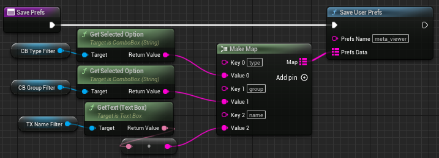
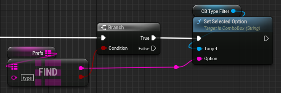

# <span style="color:white">Editor Utility Widgets (EUWs) and Python</span>

We can open, close, and query the currently running EUW editor tools using Python. We can also call
Python logic from our editor tools using Python-based BP nodes, such as to save/load user prefs.
This page covers both topics and includes a general warning for any editor tools using Python-based BP nodes.

This page covers the [editor_tools](../unreal_plugin/PythonRecipeBook/Content/Python/demo/editor_tools.py)
python module

<br>

# <span style="color:yellow">An Important Warning</span>
<ul>

This page covers an implementation that requires more safety measures to use effectively. The 
[Making Python Blueprint Functions Safer documentation page](./09_making_python_BP_functions_safer.md)
covers the work required to make this approach safer to use, all of which is provided in this project's Unreal plugin and
implemented on the `meta_viewer` tool.

</ul>
<br>


## <span style="color:yellow">Opening/Closing Editor Utility Widgets</span>
<ul>

When it comes to editor tools we have a couple convenient functions to rely on.
The [EditorUtilitySubsystem](https://docs.unrealengine.com/5.1/en-US/PythonAPI/class/EditorUtilitySubsystem.html)
has everything we need to launch, query, and close our tools.

### <span style="color:orange">Launching Editor Utility Widgets</span>
<ul>

To launch an Editor Widget from python we have two options depending on whether we wish to save its window ID: 
[spawn_and_register_tab()](https://docs.unrealengine.com/5.1/en-US/PythonAPI/class/EditorUtilitySubsystem.html#unreal.EditorUtilitySubsystem.spawn_and_register_tab)
or
[spawn_and_register_tab_and_get_id()](https://docs.unrealengine.com/5.1/en-US/PythonAPI/class/EditorUtilitySubsystem.html#unreal.EditorUtilitySubsystem.spawn_and_register_tab_and_get_id).

For this example we'll intentionally ignore the ID. If we know our asset path here's how we can launch our tool:
```python
asset_path = "/PythonRecipeBook/sample_tools/meta_viewer"
asset = unreal.load_asset(asset_path)
unreal_systems.EditorUtilitySubsystem.spawn_and_register_tab(asset)
```

</ul>

### <span style="color:orange">Is an Editor Utility Widget Running?</span>
<ul>

If we want to know whether an editor tool is running we can use one of two options
depending on if we know the Tab ID name for the given tool.

If we know the `asset_tab_id` we can look for it using 
[does_tab_exist()](https://docs.unrealengine.com/5.1/en-US/PythonAPI/class/EditorUtilitySubsystem.html#unreal.EditorUtilitySubsystem.does_tab_exist):
    
```python
if unreal_systems.EditorUtilitySubsystem.does_tab_exist(asset_tab_id)
```

If we don't have the Tab ID we can use
[find_utility_widget_from_blueprint()](https://docs.unrealengine.com/5.1/en-US/PythonAPI/class/EditorUtilitySubsystem.html#unreal.EditorUtilitySubsystem.find_utility_widget_from_blueprint).
If this function returns any information at all it means the tool is running:
    
```python
if unreal_systems.EditorUtilitySubsystem.find_utility_widget_from_blueprint(asset)
```

Both methods are valid, although as the second method requires a blueprint asset it might
not be as performant if you're trying to check for all currently running editor tools.

</ul>

### <span style="color:orange">Closing an Editor Utility Widget</span>
<ul>

To close an editor tool we will need its window ID. If we have the `asset_tab_id` we can use
[close_tab_by_id()](https://docs.unrealengine.com/5.1/en-US/PythonAPI/class/EditorUtilitySubsystem.html#unreal.EditorUtilitySubsystem.close_tab_by_id):
```python
unreal_systems.EditorUtilitySubsystem.close_tab_by_id(asset_tab_id)
```

If we don't have the ID but know the asset we can still make this work! 
[find_utility_widget_from_blueprint()](https://docs.unrealengine.com/5.1/en-US/PythonAPI/class/EditorUtilitySubsystem.html#unreal.EditorUtilitySubsystem.find_utility_widget_from_blueprint)
will tell us if it's currently open, if it is we'll just re-open the window to get its ID:
```python
if unreal_systems.EditorUtilitySubsystem.find_utility_widget_from_blueprint(asset):
  instance, asset_tab_id = unreal_systems.EditorUtilitySubsystem.spawn_and_register_tab_and_get_id(asset)
  unreal_systems.EditorUtilitySubsystem.close_tab_by_id(asset_tab_id)
```

Since the tab is already open `spawn_and_register_tab_and_get_id` won't really have to do much,
it's just an easy way to get the proper Tab ID!

</ul>

### <span style="color:orange">What is the Window ID?</span>
<ul>

In Unreal `5.1` the Tab ID is based on the asset's object path like so:
```python
f"{asset.get_path_name()}_ActiveTab"
# ex: Game/Tools/my_awesome_tool.my_awesome_tool_ActiveTab
```

If we want to make sure a tool is closed we could also run:
```python
success = unreal_systems.EditorUtilitySubsystem.close_tab_by_id(f"{asset.get_path_name()}_ActiveTab")
```
It's okay if it's not running or not found, this command will only return True if it was found and closed

</ul>
</ul>
<br>


## <span style="color:yellow">Saving User Prefs</span>
<ul>

One cool thing we can do in Python is save or load user prefs for our tools. This will require Blueprint
logic as well as a Python function.

We'll start on the Python side first, for our tool we want to:
- receive an Unreal.Map(str,str) of {key:value} prefs data
- save a json dict of {key:value} settings
- make a unique prefs file for any tool
- save the data to disk

<br>

```python
@unreal.ufunction(
    static=True, params=[str, unreal.Map(str, str)]
)
def save_user_prefs(prefs_name, prefs_data) :
    """Python Blueprint Node -- save some basic prefs data"""

    # The prefs data will come in as an Unreal Map from the BP Graph
    # Convert it to a json compliant dict
    prefs = {
        str(key): str(value)
        for key, value in prefs_data.items()
    }

    # we'll save this file under '<project_dir>/Saved/pytemp/unreal_prefs_<pref>.json'
    prefs_file = Path(
        unreal.Paths.project_saved_dir(), 
        "pytemp",
        f"unreal_prefs_{prefs_name}.json"
    )
    
    # create the folder path if necessary
    if not prefs_file.exists():
        prefs_file.parent.mkdir(parents=True, exist_ok=True)
    
    # write the prefs dict to the json file
    with prefs_file.open("w", encoding="utf-8") as f:
        json.dump(prefs, f, indent=2)
```
In the Blueprint Graph we're on the hook for providing the name of each pref and what data goes in it. 
Using `Make Map` we can store any user input / properties we desire to appropriately named keys:



It's best to call this function from the `Event Destruct` Event, which will trigger as the tool is closed.

</ul>
<br>

## <span style="color:yellow">Loading User Prefs</span>
<ul>

Loading our user prefs is a bit more involved in the BP Graph.

In Python, we can just return the prefs data if the prefs file exists. Unreal will convert the json
dict into an Unreal.Map for us:
```python
@unreal.ufunction(
        static=True, ret=unreal.Map(str, str), params=[str],
        pure=True, meta=dict(Category="demo | EUW | prefs")
    )
    def load_user_prefs(prefs_name) :
        """Python Blueprint Node -- load some basic prefs data"""

        # use the same path structure as the save and make sure it exists
        prefs_file = Path(
            unreal.Paths.project_saved_dir(), 
            "pytemp",
            f"unreal_prefs_{prefs_name}.json"
        )
        if not prefs_file.exists():
            return {}

        # we can return the dict as-is, Unreal will convert it to a Map(str,str) for us
        return json.loads(prefs_file.read_text())
```

In the Blueprint Graph we can call this Python Function, store the results in a `Prefs` local variable,
and for each expected pref perform the appropriate action to load it:



Loading the prefs is one of the first things a tool should do on `construct`. If our save and load 
states are properly in place the tool will remember our options from last time and take us back to 
our previous settings.

The sample tool `meta_viewer` (covered on the next page) uses this prefs feature, 
it's not too exciting here in the docs but try it out!

</ul>
<br>


# <span style="color:yellow">Summary</span>
<ul>

Python offers a lot of potential to our Editor Utility Widgets. We can launch and manage our editor tools
from Python, and we can even add new functionality to our tools as well.

</ul>
