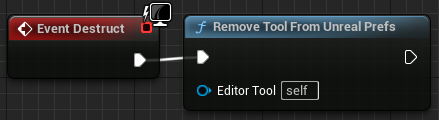
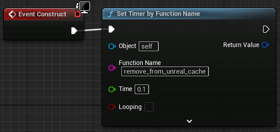
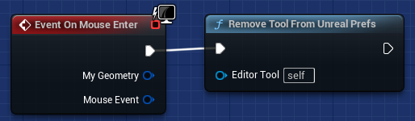

# <span style="color:white">Making Python-based BP Functions Safer</span>

Revisiting the warnings mentioned on the
[Blueprint Function Libraries](./02_blueprint_function_libraries.md)
and
[Editor Utility Widgets](./07_editor_utility_widgets.md)
documentation pages, there are some steps we can take to make Python-based Blueprint Function Nodes safer to use
in our editor tools.

This page covers parts of the [editor_tools](../unreal_plugin/PythonRecipeBook/Content/Python/demo/editor_tools.py)
python module and parts of the
[PythonUtilsLibrary](../unreal_plugin/PythonRecipeBook/Source/PythonRecipeBook/Private/PythonUtilsLibrary.cpp)
C++ module

<br>

## <span style="color:yellow">The Challenge</span>
<ul>

The challenge with Python-based BP Functions comes from how Unreal handles its startup event.
Python is an Unreal Plugin, it's not the first thing Unreal loads. Before the Python plugin has a
chance to load Unreal has already opened the project's default 3D Level and any Editor Utility Widgets that
were cached. Any assets referencing Python-based BP Functions in the default 3D Level or cached editor tools will
be broken on startup because their Python-based BP Functions couldn't be found.

Here is an example of an editor tool that has broken on Editor startup because it was cached:
```
LogBlueprint: Error: [AssetLog] C:\ue_projects\demo_project\Plugins\PythonRecipeBook\Content\sample_tools\meta_viewer.uasset: [Compiler] In use pin  Array To Match  no longer exists on node  Get Item Data For Euw . Please refresh node or break links to remove pin.
LogBlueprint: Error: [AssetLog] C:\ue_projects\demo_project\Plugins\PythonRecipeBook\Content\sample_tools\meta_viewer.uasset: [Compiler] In use pin  Return Value  no longer exists on node  Get Item Data For Euw . Please refresh node or break links to remove pin.
LogBlueprint: Error: [AssetLog] C:\ue_projects\demo_project\Plugins\PythonRecipeBook\Content\sample_tools\meta_viewer.uasset: [Compiler] Could not find a function named "get_item_data_for_euw" in 'meta_viewer'.
Make sure 'meta_viewer' has been compiled for  Get Item Data For Euw
```
Any editor tool open when the Unreal Editor is closed will be cached and likely broken the next time the project is opened. 

<br>

In the following sections we'll go over a means of preventing this error by making sure our tools don't get cached.


### <span style="color:orange">The Necessary c++ Logic</span>
<ul>

This problem can't be solved in Python alone, we need some help from C++. In C++ we need to get the Editor Utility 
Subsystem's `LoadedUIs` property and remove our editor utility widget from it. This C++ list property is what gets written
to the user prefs file and causes the startup issues. 

Here the function we need (available in the 
[PythonRecipeBook plugin](../unreal_plugin/PythonRecipeBook/Source/PythonRecipeBook/Private/PythonUtilsLibrary.cpp)):
```cpp
void UPythonUtilsLibrary::ClearEditorToolFromPrefs(UEditorUtilityWidgetBlueprint* EditorWidget) {
    UEditorUtilitySubsystem* EUS = GEditor->GetEditorSubsystem<UEditorUtilitySubsystem>();
    EUS->LoadedUIs.Remove(EditorWidget);
    EUS->SaveConfig();
}
```
<br>

Once our C++ Plugin module is built, we should be able to call the function from Python using:
```python
unreal.PythonUtilsLibrary.clear_editor_tool_from_prefs(editor_widget_blueprint)
```
This will allow us to remove the given Editor Utility Widget asset from the user prefs.

</ul>


### <span style="color:orange">Extending the c++ Logic using Python</span>
<ul>

Now that we have the core C++ functionality available we can add an extra level of convenience to it in Python.

The goal of this function is to pass the editor tool instance's `self` reference from Blueprints to Python automatically,
find the Content Browser asset reference, and pass that to our C++ function:
```python
    @unreal.ufunction(
        static=True, params=[unreal.EditorUtilityWidget],
        meta=dict(DefaultToSelf="editor_tool")
    )
    def remove_tool_from_unreal_prefs(editor_tool):
        """Python Blueprint Node -- Manage Editor Tools using Python-based nodes"""

        # Get the Content Browser asset and remove it from the c++ User Prefs
        editor_tool_path = str(editor_tool.get_class().get_outer().get_path_name())
        editor_tool_asset = unreal.find_asset(editor_tool_path)
        unreal.PythonUtilsLibrary.clear_editor_tool_from_prefs(editor_tool_asset)
```

- The `DefaultToSelf` meta entry will auto-populate the `editor_tool` arg with a reference to `self`
- `editor_tool_path` is the EUW's package path, such as `Content/tools/my_tool`
- `editor_tool_asset` is a reference to the proper base asset needed for `clear_editor_tool_from_prefs()`

<br>

If we call this node on `Event Destruct`, Unreal Editor shutdown will no longer cache this tool to the INI file:




</ul>

### <span style="color:orange">Making it Safer</span>
<ul>

`Event Destruct` will work on its own for intentional Editor shutdowns, but it's not reliable if the Editor
crashes. Here are two additional locations we can call our new function from:

1) At the end of `Event Construct` is when the editor tool gets cached to the user prefs, one way we can make a
`Post Construct` is to use `Set Timer by Function Name`. The declared function will get run after the editor tool has been cached 
if we set the timer to `0.1`, just add our `Remove Tool From Unreal Prefs` function to the Blueprint Function we make for this
timer and we should be good:



2) Another safety measure is `On Mouse Enter`, any time the mouse enters our tool we can make sure it's removed from the cache:



It's not completely perfect, but this approach of calling the function on these three events makes it much safer to use
Python-based BP Functions in our editor tools. 

</ul>

### <span style="color:orange">Managing Our Own Shutdown/Startup</span>
<ul>

The functionality that we lose in the short term is the convenience of Unreal reopening our editor tools the next
time we start up the Unreal project. It is possible to restore this convenience in Python, but that may be a future
topic. A working solution is provided in the demo plugin though, try running the `meta_viewer` tool and reopening the Unreal Project!

</ul>


# <span style="color:yellow">Summary</span>
<ul>

Editor Utility Widgets using Python-based BP nodes can be dangerous, but with a little c++ we can 
make them much safer to use. Please feel free to use the solution in the demo plugin or implement your own.

Once we get past the dangers of EUWs using Python-based BP nodes, there is a lot of power in using Python in
editor tools: we can easily set up user prefs, manage our active tools, and write functionality beyond Unreal
with ease.

</ul>
